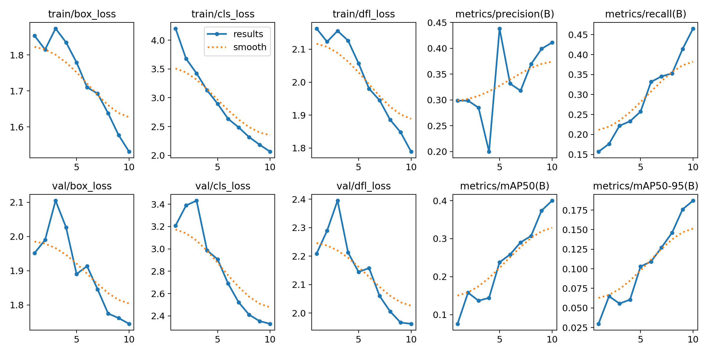
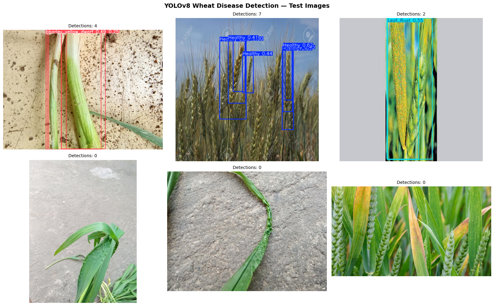

# Wheat-disease-detector
YOLOv8 object detection model for wheat disease identification in field imagery

A YOLOv8 object detection model that automatically identifies and localises 
nine wheat diseases in field imagery, built as part of my transition into 
computational crop phenotyping.

## Biological Motivation

Manual disease assessment across large wheat breeding trials is time-consuming, 
subjective, and impossible to scale across thousands of plots. This project 
develops an automated detection pipeline that can localise and classify multiple 
disease instances within a single field image — directly mirroring the challenge 
of high-throughput phenotyping in commercial cereal breeding programmes.

Unlike image classification (which labels an entire image), object detection 
locates exactly where on the image each disease occurs and draws precise bounding 
boxes around affected regions. This spatial precision is critical for drone-based 
phenotyping where disease hotspots must be mapped across large field areas.

## Dataset

- **Source:** Wheat Disease Combined Dataset (Kaggle)
- **Total images:** 3,090 field images
- **Split:** 2,341 training / 599 validation / 150 test
- **Disease categories:** 9

| Category | Description |
|----------|-------------|
| Healthy | Disease-free wheat |
| Leaf Rust | Fungal disease causing orange pustules |
| Yellow Rust | Stripe rust causing yellow lesions |
| Powdery Mildew | Fungal white powdery coating |
| Smut | Fungal disease replacing grain with spores |
| Stem Rust | Fungal disease affecting stems and leaves |
| Barley Yellow Dwarf | Viral disease affecting cereals including barley |
| Septoria | Fungal leaf blotch disease |
| Crown and Root Rot | Soil-borne fungal disease |

Note: The inclusion of **Barley Yellow Dwarf** makes this dataset directly 
relevant to barley phenotyping research, as this virus affects both wheat 
and barley crops in commercial breeding trials.

## Model

- **Architecture:** YOLOv8n (nano) — optimised for speed and efficiency
- **Framework:** Ultralytics YOLOv8 / PyTorch
- **Approach:** Transfer learning from COCO pretrained weights
- **Training:** 10 epochs, batch size 16, image size 640×640
- **Hardware:** Tesla T4 GPU (Google Colab)

## Training Results

| Epoch | Box Loss | Cls Loss | mAP50 |
|-------|----------|----------|-------|
| 1     | 1.853    | 4.203    | 0.076 |
| 2     | 1.815    | 3.678    | 0.158 |
| 3     | 1.873    | 3.424    | 0.137 |
| 4     | 1.835    | 3.130    | 0.144 |
| 5     | 1.779    | 2.896    | 0.238 |
| 6     | 1.710    | 2.636    | 0.258 |
| 7     | 1.693    | 2.487    | 0.290 |
| 8     | 1.638    | 2.318    | 0.307 |
| 9     | 1.577    | 2.185    | 0.374 |
| 10    | 1.531    | 2.064    | 0.400 |

Both box loss and classification loss decreased consistently across all 
10 epochs, with mAP50 improving from 7.6% to 40.0%.

## Training Curves



## Per-Class Performance

| Disease | Precision | Recall | mAP50 |
|---------|-----------|--------|-------|
| Healthy | 0.300 | 0.417 | 0.249 |
| Leaf Rust | 0.429 | 0.703 | 0.496 |
| Yellow Rust | 0.722 | 0.160 | 0.331 |
| Powdery Mildew | 0.409 | 0.448 | 0.415 |
| Smut | 0.462 | 0.683 | 0.611 |
| Stem Rust | 0.252 | 0.474 | 0.262 |
| Barley Yellow Dwarf | 0.266 | 0.535 | 0.324 |
| Septoria | 0.366 | 0.583 | 0.517 |
| Crown and Root Rot | 0.534 | 0.182 | 0.401 |

## Confusion Matrix


## Detection Results on Test Images



The model successfully detected between 2 and 7 disease instances per image 
across test field photographs, demonstrating its ability to localise multiple 
disease occurrences simultaneously within a single field image.

## Key Scientific Findings

**1. Disease-specific detection performance varies meaningfully**
Smut achieved the highest mAP50 (61.1%) while Stem Rust performed weakest 
(26.2%). This reflects the visual distinctiveness of each disease — Smut 
produces clearly defined dark masses replacing grain, while Stem Rust produces 
variable reddish-brown pustules that overlap visually with other rust diseases.

**2. Rust disease confusion is biologically meaningful**
Yellow Rust showed high precision (72.2%) but low recall (16.0%), suggesting 
the model is conservative — only flagging detections it is confident about. 
This precision-recall tradeoff reflects the visual similarity between Yellow 
Rust and Leaf Rust, both of which produce lesions on leaf surfaces.

**3. Barley Yellow Dwarf detection is promising**
Despite being a viral disease with subtler visual symptoms than fungal diseases, 
the model achieved 32.4% mAP50 for Barley Yellow Dwarf — meaningful given the 
limited training examples and the disease's relevance to barley breeding programmes.

**4. More epochs and data would improve performance**
With only 10 epochs of training, the loss curves suggest the model had not yet 
plateaued — extended training on a larger dataset would likely push mAP50 
significantly higher.

## Limitations

- 10 epochs of training — performance would improve with longer training
- Dataset contains ground-level field imagery rather than drone/UAV imagery
- Model has not been tested on imagery from different geographic regions
- Crown and Root Rot underrepresented — only 11 test instances
- RGB-only imagery may limit discrimination of visually similar rust diseases

## Future Work

- Fine-tune on drone-collected aerial imagery to test performance at canopy level
- Extend dataset with barley-specific disease imagery
- Train YOLOv8m or YOLOv8l (larger models) for improved accuracy
- Integrate detection pipeline with GPS coordinates for field disease mapping
- Connect disease detection outputs to genomic data for G×P analysis

## Relevance to Drone-Based Cereal Phenotyping

This project directly addresses the core challenge of automated cereal crop 
assessment. The same pipeline — loading field imagery, running object detection, 
localising and counting biological features — underpins high-throughput 
phenotyping systems for commercial breeding trials. The inclusion of Barley 
Yellow Dwarf in the dataset establishes a direct link to barley breeding 
research, where automated detection of disease and yield-related traits from 
drone imagery is an active and important research frontier.

## How to Run

```python
# Install dependencies
!pip install ultralytics kaggle

# Download dataset
!kaggle datasets download -d anshulnp2004/wheat-disease-combined-better

# Run detector
!python wheat_disease_detector.py
```

## Technologies Used

- Python 3.12
- YOLOv8 (Ultralytics 8.4.51)
- PyTorch 2.10
- Google Colab (Tesla T4 GPU)
- Kaggle Datasets API

## Author

**Aanuoluwapo Mike Akinyemi**
MSc Agriculture (Plant Breeding) — University of Ibadan, Nigeria
Visiting Research Scholar — IPK Gatersleben, Germany (Barley Genomics)

[LinkedIn](https://www.linkedin.com/in/aanuoluwapo-akinyemi-021aba1aa/)
